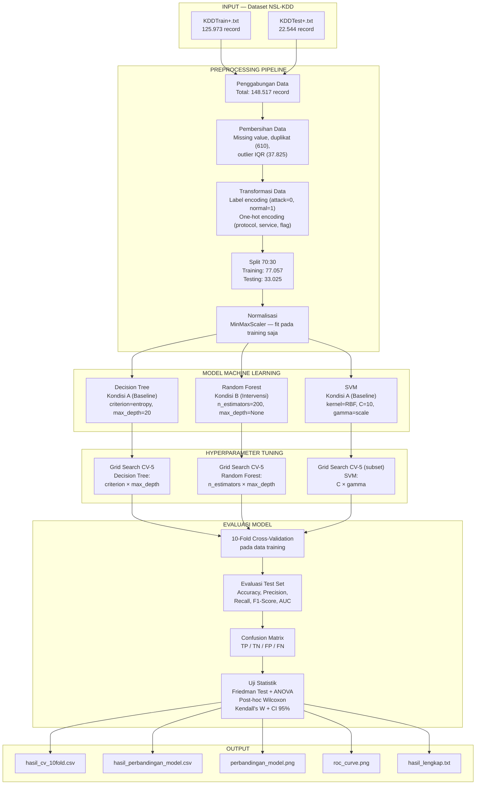
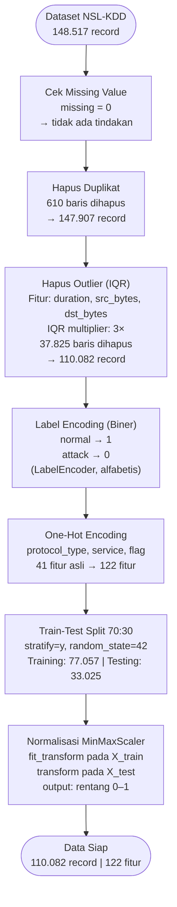
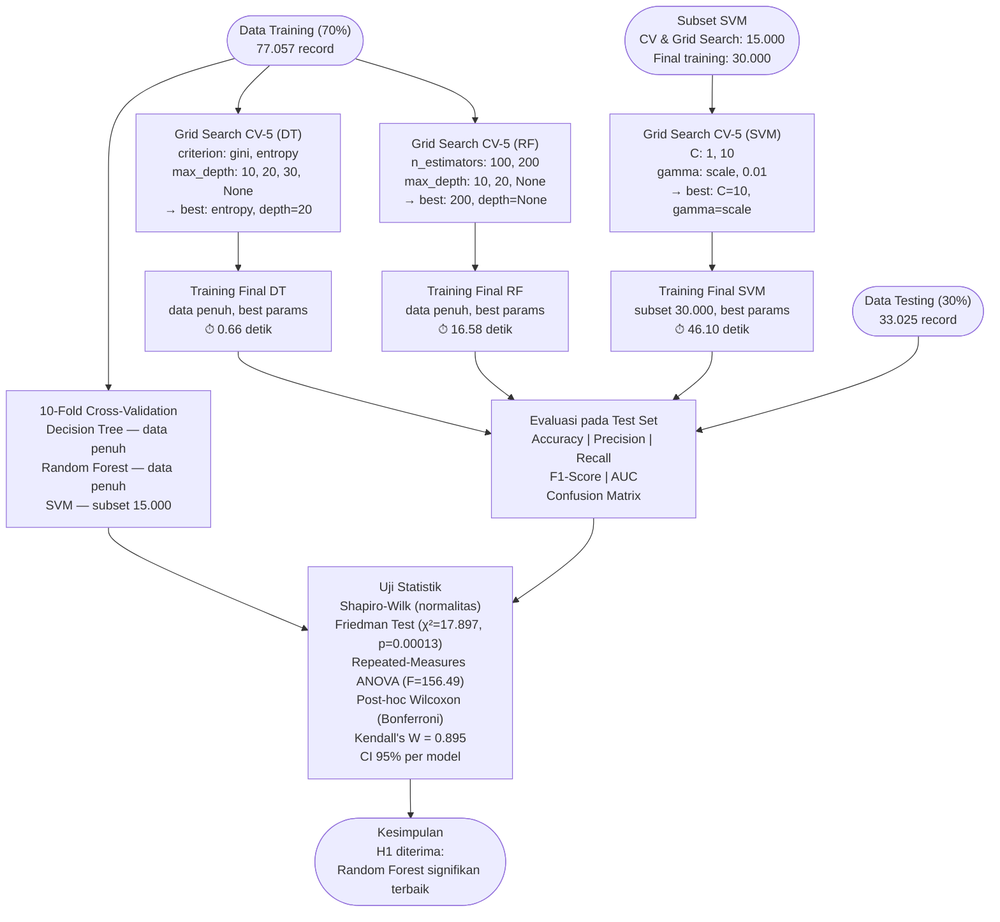
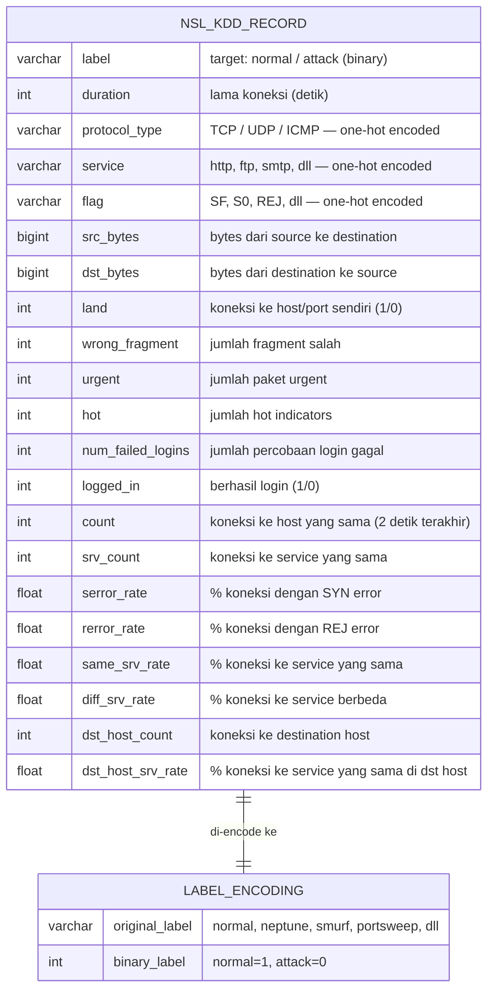

# Arsitektur, Desain, dan Landasan Teori

**Judul Penelitian:** Analisis Penerapan Algoritma Random Forest dalam
Meningkatkan Akurasi Deteksi Intrusi pada Jaringan Komputer
**Peneliti:** Panji Kurniawan | NIM 240202904
**Status:** Selesai (hasil Tahap 1 — Perancangan Metodologi & Desain Sistem)

---

## 1. Arsitektur Komponen Sistem

Penelitian ini merupakan eksperimen komparatif berbasis simulasi (offline).
Tidak ada sistem real-time — seluruh proses berjalan pada dataset statis NSL-KDD
di lingkungan Google Colab.



---

## 2. Alur Preprocessing Data



---

## 3. Alur Eksperimen dan Evaluasi



---

## 4. Desain Variabel Penelitian

### 4.1 Variabel Independen (IV)

Algoritma machine learning yang digunakan — bersifat kategorikal dengan 3 kategori:

| Kategori | Algoritma | Kondisi |
|---|---|---|
| Kondisi A (Baseline) | Decision Tree | Model tree-based tunggal, interpretable |
| Kondisi A (Baseline) | Support Vector Machine (SVM) | Model margin-based, kernel RBF |
| **Kondisi B (Intervensi)** | **Random Forest** | Ensemble dari 200 pohon keputusan |

### 4.2 Variabel Dependen (DV)

Performa deteksi intrusi — diukur secara numerik pada test set yang sama (33.025 record):

| Metrik | Tipe Data | Range Valid | Keterangan |
|---|---|---|---|
| Accuracy | float | [0, 1] | Proporsi prediksi benar dari total |
| Precision | float | [0, 1] | TP / (TP + FP) — menghindari false positive |
| Recall | float | [0, 1] | TP / (TP + FN) — menghindari false negative |
| F1-Score | float | [0, 1] | Harmonic mean precision & recall |
| AUC | float | [0, 1] | Area Under ROC Curve |

---

## 5. Skema Dataset NSL-KDD

NSL-KDD terdiri dari **41 fitur asli** yang merepresentasikan karakteristik
koneksi jaringan, dikategorikan sebagai berikut:



**Kategori serangan di NSL-KDD:**

| Kategori | Contoh Serangan | Deskripsi |
|---|---|---|
| **DoS** | neptune, smurf, back | Denial of Service — menghabiskan resource |
| **Probe** | portsweep, nmap, satan | Scanning jaringan untuk mengidentifikasi kelemahan |
| **R2L** | ftp_write, guess_passwd | Remote to Local — akses tidak sah dari luar |
| **U2R** | buffer_overflow, rootkit | User to Root — eskalasi privilege |
| **Normal** | — | Trafik jaringan normal |

---

## 6. Landasan Teori Algoritma

### 6.1 Decision Tree

Decision Tree membagi dataset secara rekursif berdasarkan fitur yang paling
informatif (menggunakan kriteria impurity seperti Gini atau Entropy) hingga
terbentuk model berbentuk pohon keputusan yang dapat digunakan untuk klasifikasi.

**Karakteristik:**
- Interpretable — aturan keputusan dapat dibaca langsung
- Cepat saat prediksi (O(log n) terhadap jumlah node)
- Rentan overfitting pada data kompleks

**Parameter terbaik pada penelitian ini:**
```
criterion  = entropy  (Information Gain)
max_depth  = 20
```

**Formula Information Gain:**
```
IG(S, A) = H(S) - Σ (|Sv|/|S|) × H(Sv)
H(S) = -Σ p(c) × log₂(p(c))     (Shannon Entropy)
```

### 6.2 Random Forest

Random Forest adalah metode ensemble yang membangun banyak Decision Tree secara
independen pada subset acak data (bagging) dan fitur (feature randomness), lalu
menggabungkan prediksi melalui majority voting.

**Karakteristik:**
- Mengurangi variance melalui ensemble (mengatasi overfitting DT tunggal)
- Robust terhadap noise dan outlier
- Waktu training lebih lama dari DT tunggal

**Parameter terbaik pada penelitian ini:**
```
n_estimators = 200  (jumlah pohon)
max_depth    = None (pohon tumbuh penuh)
random_state = 42
```

**Formula prediksi (majority voting):**
```
ŷ = mode({ T₁(x), T₂(x), ..., T_B(x) })
di mana T_b adalah pohon ke-b dari B pohon total
```

### 6.3 Support Vector Machine (SVM)

SVM mencari hyperplane dengan margin maksimum yang memisahkan dua kelas data.
Untuk data non-linear, kernel trick (RBF) digunakan untuk memetakan data ke
dimensi yang lebih tinggi di mana pemisahan linear memungkinkan.

**Karakteristik:**
- Efektif di ruang dimensi tinggi
- Kompleksitas komputasi O(n²)–O(n³) — berat untuk data besar
- Sensitif terhadap skala fitur (perlu normalisasi)

**Parameter terbaik pada penelitian ini:**
```
kernel       = rbf   (Radial Basis Function)
C            = 10    (regularization parameter)
gamma        = scale (= 1 / (n_features × X.var()))
probability  = True  (untuk perhitungan AUC)
```

**Catatan implementasi:** SVM dilatih pada subset 30.000 record dari 77.057
data training karena keterbatasan komputasi kernel RBF pada dataset besar.

**Formula kernel RBF:**
```
K(x, x') = exp(-γ × ||x - x'||²)
```

---

## 7. Landasan Teori Evaluasi

### 7.1 Metrik Klasifikasi

Diturunkan dari Confusion Matrix (TP, TN, FP, FN):

```
Accuracy  = (TP + TN) / (TP + TN + FP + FN)
Precision = TP / (TP + FP)
Recall    = TP / (TP + FN)
F1-Score  = 2 × (Precision × Recall) / (Precision + Recall)
```

**Dalam konteks deteksi intrusi:**
- TP = serangan yang berhasil terdeteksi (attack diprediksi attack)
- FN = serangan yang lolos (attack diprediksi normal) — **paling kritis**
- FP = false alarm (normal diprediksi attack)

### 7.2 Uji Statistik

Karena membandingkan lebih dari 2 grup berpasangan (paired, data dari fold yang sama):

| Uji | Fungsi | Hasil |
|---|---|---|
| Shapiro-Wilk | Uji normalitas distribusi 10-fold per model | Ketiga model normal (p > 0.05) |
| Friedman Test | Uji signifikansi perbedaan >2 grup berpasangan | χ²=17.897, **p=0.00013** |
| Repeated-Measures ANOVA | Konfirmasi (data lolos normalitas) | F=156.49, p<0.0001 |
| Kendall's W | Effect size untuk Friedman test | W=0.895 **(Large)** |
| Wilcoxon Signed-Rank | Post-hoc berpasangan (Bonferroni α=0.0167) | Semua pasangan signifikan |
| Confidence Interval 95% | Rentang ketidakpastian mean per model | DT [99.43%,99.55%], RF [99.54%,99.61%], SVM [98.07%,98.51%] |

---

## 8. Keputusan Desain Penelitian

| Aspek | Keputusan | Justifikasi |
|---|---|---|
| Skema split data | Gabung KDDTrain+ + KDDTest+, split ulang 70:30 acak | Sesuai proposal; distribusi lebih homogen |
| Normalisasi | MinMaxScaler (bukan Z-score/StandardScaler) | Sesuai script implementasi; cocok untuk SVM yang sensitif skala |
| Penanganan outlier | IQR multiplier 3× pada duration, src_bytes, dst_bytes | Threshold konservatif agar data serangan (yang secara alami ekstrem) tidak terhapus berlebihan |
| Subset SVM | 15.000 (CV) / 30.000 (final training) | Kernel RBF O(n²–n³) tidak scalable pada 77.057 record — dicatat sebagai limitation |
| Random seed | 42 di semua level | Reproducibility — hasil identik saat dijalankan ulang |
| Uji statistik | Friedman (utama) + ANOVA (konfirmasi) | Data berpasangan (10-fold), >2 grup; Friedman konservatif untuk n kecil |

---

## 9. Mapping ke Implementasi Kode

| Komponen | Implementasi | File |
|---|---|---|
| Preprocessing pipeline | `pandas.get_dummies()`, `LabelEncoder`, `MinMaxScaler`, `train_test_split` | `penelitian_deteksi_intrusi_FIX_SVM.py` STEP 2–8 |
| Subset SVM | `np.random.choice(..., replace=False)` dengan `seed=42` | STEP 9B |
| Cross-validation | `cross_val_score(..., cv=10, n_jobs=-1)` | STEP 10 |
| Grid search | `GridSearchCV(..., cv=5, n_jobs=-1)` | STEP 11–13 |
| Evaluasi metrik | `accuracy_score`, `precision_score`, `recall_score`, `f1_score`, `roc_auc_score` | STEP 14 |
| Visualisasi | `matplotlib.pyplot` — bar chart + ROC curve | STEP 16–17 |
| Uji statistik | `scipy.stats.friedmanchisquare`, `scipy.stats.wilcoxon`, `scipy.stats.shapiro` | Analisis terpisah (WS-14) |

**Acuan lengkap:** [`05-kode/penelitian_deteksi_intrusi_FIX_SVM.py`](../05-kode/)
